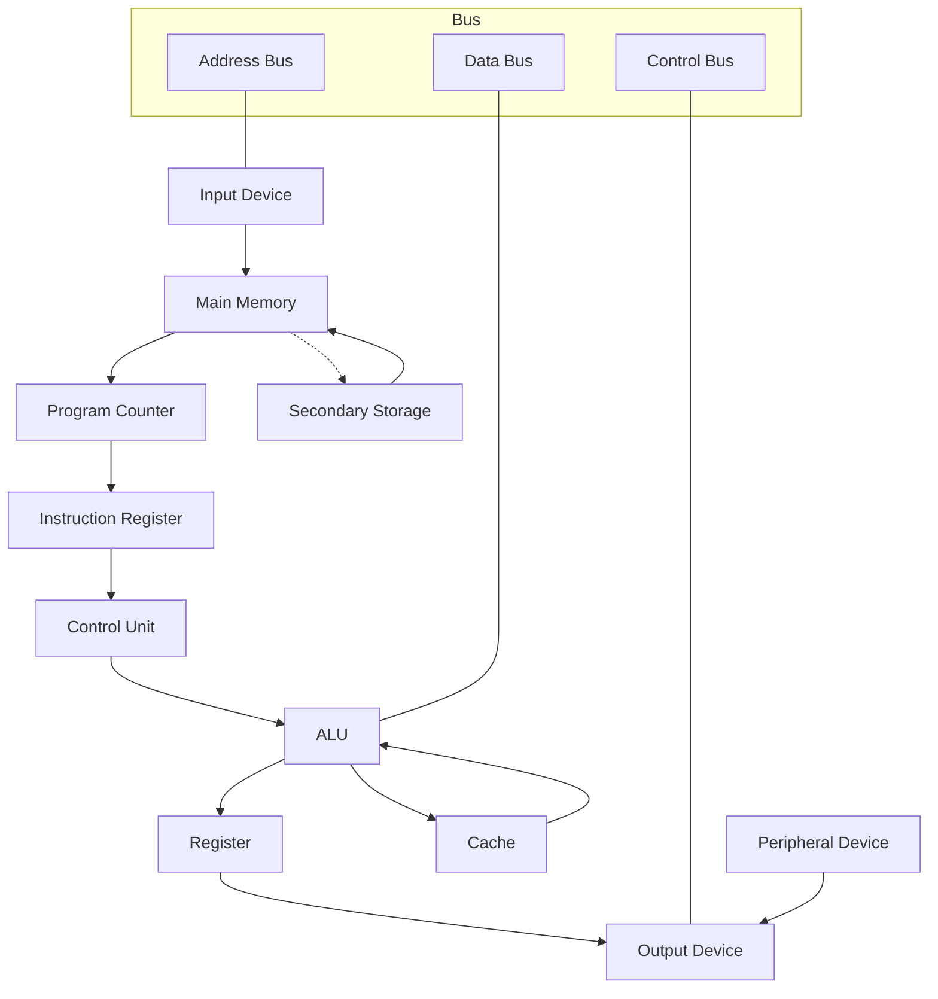

> **📅 업로드 날짜**  
> 2025-07-09
>
> **🗂 분류**  
> Computer Architecture  
>
> **🔗 노션 링크**  
> [노션에서 보기](https://important-marquess-d42.notion.site/22aa654e658a8095a333c4702ec7bebc)

# 컴퓨터의 구성

컴퓨터가 데이터를 입력받고, 처리하고, 저장하고, 출력하기까지의 **하드웨어 구성 요소와 동작 흐름**을 정리한 문서입니다.

---

## 1. 전체 시스템 구성 5요소

| 구성요소 | 역할 |
| -------- | ---- |
| **입력 장치** | 사용자로부터 데이터를 입력 예: 키보드, 마우스, 터치스크린 |
| **중앙처리장치(CPU)** | 연산, 명령어 해석, 전체 시스템 제어 |
| **기억 장치** | 데이터를 저장 예: RAM, SSD 등 |
| **출력 장치** | 처리 결과를 사용자에게 출력 예: 모니터, 프린터 |
| **보조장치 / 주변장치** | 네트워크, 소리 등 부가기능 담당 예: 사운드 카드, LAN 카드 |

---

## 2. CPU 내부 구조

| 구성요소 | 설명 |
| -------- | ---- |
| **제어 장치 (CU)** | 명령어 해석 및 CPU 내 제어 |
| **산술논리연산장치 (ALU)** | 산술 및 논리 연산 수행 |
| **레지스터** | CPU 내부의 초고속 임시 저장소 |
| **클럭 (Clock)** | CPU 전체 동작을 일정한 주기로 **동기화**  
| **파이프라인** | 명령어 실행 단계를 겹쳐 처리 속도 향상 |
| **캐시 메모리** | 자주 사용하는 데이터의 고속 임시 저장소 |
| **버스 (Bus)** | CPU 내부 요소 간 데이터, 주소, 제어 신호 전달 |

### ❓ 클럭이 전체 동기화를 한다는 건?

> 박자 맞추기⏱:  
> 명령어를 언제 처리할지 ‘시간 약속’을 지켜주는 장치  
> → 클럭이 어긋나면 연산 오류 발생 가능!

### ❓ 파이프라인이 실행 단계를 겹친다는 건?

> CPU가 명령어를 **한 줄씩 순서대로**가 아니라,  
> 여러 명령어를 **동시에 서로 다른 단계에서 처리**  
> → 공정 겹치기! 처리 효율 증가

| 시간 | 명령어 A | 명령어 B | 명령어 C |
|------|----------|----------|----------|
| T1 | Fetch |          |          |
| T2 | Decode | Fetch    |          |
| T3 | Execute| Decode   | Fetch    |
| T4 | Memory | Execute  | Decode   |
| T5 | Write  | Memory   | Execute  |

### 명령어 실행 순서

💡 명령어 하나가 실행될 때 아래의 순서로 처리됨:

1. **Fetch** – 프로그램 카운터(PC)가 가리키는 메모리 주소에서 명령어 읽기  
2. **Decode** – 명령어 해석 (CU)  
3. **Execute** – ALU가 연산 수행  
4. **Memory Access** – 필요 시 메모리 접근  
5. **Write Back** – 결과를 레지스터나 RAM에 저장  

---

## 3. 기억장치 계층 구조

> 속도는 빠르지만 비싸고,  
> 용량은 클수록 느리며 저렴한 **메모리 계층 구조**

| 계층 | 설명 | 속도 | 크기 | 위치 |
|------|------|------|------|------|
| **레지스터** | CPU 연산용 임시 저장소 | 💨 가장 빠름 | 매우 작음 | CPU 내부 |
| **캐시 (L1, L2, L3)** | 자주 쓰는 데이터 저장 | 빠름 | 작음 | CPU 내부/근처 |
| **RAM (DRAM)** | 실행 중인 프로그램 저장 | 빠름 | 수~수십 GB | 메인 메모리 |
| **SSD / HDD** | 장기 저장장치 | 느림 | 수백 GB~TB | 시스템 외부 |

### ❓ 데이터를 어디서부터 어디까지 찾는 걸까?

→ 찾을수록 느리지만, 구조적 순서에 따라 **올라와서 저장됨**

---

### 💡 L1 / L2 / L3 캐시 비교

| 구분 | L1 | L2 | L3 |
|------|----|----|----|
| 위치 | CPU 코어 내부 | 내부/외부 | 코어 간 공유 |
| 속도 | 가장 빠름 | 빠름 | 느림 |
| 용량 | 작음 (KB) | 중간 (MB) | 큼 (MB 이상) |
| 용도 | 명령어/데이터 초고속 처리 | L1 미스 보완 | 전체 효율 최적화 |

> 멀티코어에서는 L3가 모든 코어에 공유됨 (공용 캐시)

---

### 💡 DRAM vs SRAM

| 항목 | DRAM (Dynamic) | SRAM (Static) |
|------|----------------|---------------|
| 위치 | RAM | 캐시 |
| 속도 | 느림 | 빠름 |
| 가격 | 저렴 | 비쌈 |
| 구조 | 1T + 1C | 6T |
| 리프레시 | 필요 (재충전) | 불필요 |

> ✅ **DRAM은 메인메모리**, **SRAM은 캐시에 사용**

---

### SSD vs HDD

| 항목 | SSD | HDD |
|------|-----|-----|
| 저장 방식 | 반도체 | 회전 디스크 |
| 속도 | 빠름 | 느림 |
| 소음 | 무소음 | 기계 소음 |
| 내구성 | 충격에 강함 | 충격에 약함 |

---

## 4. 버스(Bus)의 종류와 역할

> 컴퓨터 구성 요소 간 데이터를 주고받는 **고속 통로**

| 종류 | 역할 |
|------|------|
| **데이터 버스** | 실제 데이터 전송 |
| **주소 버스** | 접근할 메모리 주소 전달 |
| **제어 버스** | 읽기/쓰기 같은 제어 신호 전달 |

### 💡 예시 흐름  
CPU가 RAM에서 값을 읽을 때:

1. 주소 버스 → "0x1234 주소로 가!"
2. 제어 버스 → "읽기(Read) 명령!"
3. 데이터 버스 → 해당 위치의 데이터 전송

---

## 5. 보조장치

| 종류 | 설명 | 예시 |
|------|------|------|
| **보조기억장치** | 장기 저장 공간 | SSD, HDD, USB |
| **주변장치** | 기능 확장 | LAN 카드, 사운드 카드, GPU 등 |

> ❓ 없어도 동작은 가능하지만, **확장성 & 사용성 증가용**

---

## 🔄 6. Computer System Flow (Mermaid Diagram)

