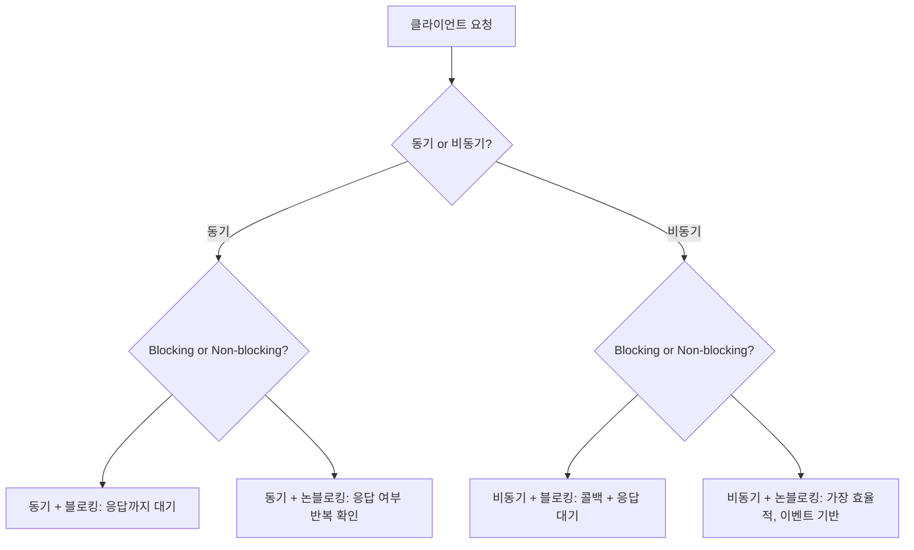

> **📅 업로드 날짜**  
> 2025-09-08
> 
> **🗂 분류**  
> network
>
> **🔗 노션 링크**  
> [노션에서 보기](https://important-marquess-d42.notion.site/Blocking-Non-blocking-Synchronous-Asynchronous-262a654e658a80afbbf2ed1038a21ab3?source=copy_link)
>
# Blocking,Non-blocking & Synchronous,Asynchronous

- **동기/비동기(Sync/Async)** → **작업 순서 제어 방식 (요청/응답)**
- **블로킹/논블로킹(Blocking/Non-blocking)** → **스레드 대기 여부**

## Synchronous vs Asynchronous (동기 vs 비동기)

| 구분 | **Synchronous (동기)** | **Asynchronous (비동기)** |
| --- | --- | --- |
| **작업 순서** | 요청 → **응답 받고** 다음 작업 | 요청 → **응답 상관없이** 다음 작업 |
| **흐름 제어** | 요청과 응답이 **시간적으로 종속** | 요청과 응답이 **독립적** |
| **장점** | 구현이 직관적 → 코드 작성 & 디버깅 쉬움 | 자원 활용 효율 ↑, 동시에 많은 작업 가능 |
| **단점** | 서버 응답 지연 → 프로그램 전체가 대기 | 구조가 복잡, 콜백 관리 필요 |
| **비유** | 음식 주문 후 **음식 나올 때까지 대기** | 음식 주문 후 **쇼핑하다 알람 오면 돌아옴** |
- **동기:** 요청 → 대기 → 응답 → 다음 작업
    
    → 흐름이 단순하니 디버깅도 쉽지만, 하나가 늦어지면 **전체 속도 저하**
    
- **비동기:** 요청 후 바로 다음 작업 → 응답 오면 콜백 실행
    
    → 동시성을 확보할 수 있어 효율적이지만, **콜백 지옥(callback hell)** 같은 문제 가능
    

✅ **콜백 지옥(callback hell):** 비동기 작업이 여러 개 중첩되면, 콜백 안에 콜백을 계속 작성해야 하는 상황이 발생합니다. **작업의 순서를 보장하기 위해** 콜백을 중첩하는 과정에서 가독성이 나빠지는 것

```java
// 동기: 응답을 받을 때까지 대기
String result = httpClient.get("https://example.com");
System.out.println(result);

// 비동기: 요청 후 콜백으로 처리
httpClient.getAsync("https://example.com", response -> {
    System.out.println(response);
});

System.out.println("응답 대기 없이 다음 작업 실행");
```

## Blocking vs Non-blocking (블로킹 vs 논블로킹)

**동기 vs 블로킹**

- **동기(Synchronous)** → "**결과를 언제 받는지**"에 대한 **작업 흐름 관점**
    
    → 응답을 받기 전까지 **다음 일을 시작하지 않는 방식 → 작업 순서 기다리는 것**
    
    → 예: **"밥 나오기 전까지 쇼핑 안 하고 식탁에서 기다림"**
    
- **블로킹(Blocking)** → "**스레드가 멈추는지 여부**"에 대한 **자원 점유 관점**
    
    → 요청한 스레드가 **응답 올 때까지 할 일을 멈추고 놀고 있음 → 스레드가 놀고 있는 상태**
    
    → 예: **"직원이 손님 음식만 보고 있다가 완성되면 다시 움직임"**
    

✅ 스레드: **프로그램 안에서 작업을 수행하는 실행 단위** (한 명의 직원)

- 블로킹 상태에서는 스레드가 **응답을 기다리며 멈춰 있어 성능이 떨어질 수 있다.**

- 블로킹→ 스레드가 **할 일이 없음(놀고 있음)**

- 논블로킹→ 스레드가 **쉴 틈 없이 일함**


| 구분 | **Blocking (블로킹)** | **Non-blocking (논블로킹)** |
| --- | --- | --- |
| **스레드 동작** | **응답이 올 때까지 현재 스레드가 멈춤**. 커널/라이브러리에 I/O를 맡기고 호출 스레드가 대기 상태로 전환됨. | **즉시 반환**. 데이터가 준비되지 않으면 “지금 없음”을 알려주고(예: `EAGAIN`/0 바이트), 스레드는 다른 일을 이어감. |
| **처리 방식** | 호출 → 커널이 준비될 때까지 **스레드 점유(대기)** → 응답 도착 시 깨어남. 관리가 단순하지만 **대기 시간 = 낭비**. | 호출 → **바로 반환** → 준비 완료 신호를 **폴링/이벤트/콜백**으로 처리. 스레드는 **일감 전환**을 자유롭게 수행. |
| **장점** | 코드가 직관적(‘요청→기다림→결과’). 디버깅이 쉬움. | **CPU 활용 극대화**, 많은 연결(동시성)에 유리. 이벤트 루프/스케줄러로 효율적인 I/O 다중화 가능. |
| **단점** | I/O가 느리면 **스레드가 묶임** → 스레드 수↑, 컨텍스트 스위칭 비용↑, 전체 처리량↓. | 구조가 복잡. 준비/완료 상태 관리, 콜백/큐/타임아웃 등 **동시성 제어가 어려움**. |
| **비유** | 친구에게 전화하고 **받을 때까지 통화 화면에서 대기** | 전화하고 **안 받으면 일단 끊고** 다른 일. **나중에 알림/재시도/콜백**으로 이어감 |

```java
// Blocking I/O
InputStream input = socket.getInputStream();
int data = input.read();  // 데이터 올 때까지 대기

// Non-blocking I/O
socketChannel.configureBlocking(false);
int bytesRead = socketChannel.read(buffer);  // 데이터 없으면 0 반환
```

## **네 가지 모델**

| 모델 | 호출자 관점(순서) | 스레드 관점(대기) | 비유 | 한 줄 요약 |
| --- | --- | --- | --- | --- |
| **동기 + 블로킹** | 응답 받을 때까지 **다음 단계 안 감** | **멈춰 대기** | 식탁에서 음식 나올 때까지 앉아 기다림 | 가장 단순하지만 대기 동안 스레드가 쉼 |
| **동기 + 논블로킹** | 응답 전에는 **다음 단계 안 감** | **즉시 반환**(직접 계속 확인: 폴링) | 카운터에 가서 “됐나요?” 계속 물어봄 | 스레드는 바쁘지만 흐름은 여전히 막힘 |
| **비동기 + 블로킹** | 결과는 **나중에 알림** | 필요 순간에 **다시 멈춤**(예: `get()`에서) | 호출벨 눌렀지만 문 앞에서 서서 기다림 | 비동기 API를 결국 동기처럼 써버림 |
| **비동기 + 논블로킹** | 결과는 **알림/콜백으로 처리**, 다음 단계 진행 | **즉시 다른 일 처리** | 주문해두고 쇼핑, 알림 오면 수령 | 고동시성에 유리, 현대적 기본 패턴 |
- **비동기+블로킹**
    - **무슨 일?** 작업은 **비동기**로 맡겼지만, 결과 필요 순간에 `join()/get()` 등으로 **다시 멈춤**.
    - **장점**: 비동기 API를 쓰면서도 특정 지점에서 결과를 **동기적으로** 받기 쉬움.
    - **단점**: 블로킹이 생겨 **동시성 이점 감소**(비동기 이득을 스스로 상쇄).
    - **언제?** 과도한 리팩토링 없이 기존 동기 코드와 점진적으로 섞을 때.



## **실무 예시**

### **1) Node.js — 비동기 + 논블로킹**

```jsx
const fs = require('fs');

console.log("파일 읽기 시작");

fs.readFile("test.txt", "utf8", (err, data) => {
    if (err) throw err;
    console.log("파일 내용:", data);
});

console.log("파일 읽기 요청 완료");
```

**출력 결과**

```
파일 읽기 시작
파일 읽기 요청 완료
파일 내용: Hello World!
```

→ 요청 후 기다리지 않고 다음 코드 실행 → 응답 시 콜백으로 처리

---

### **2) Spring WebFlux — 비동기 + 논블로킹**

```java
@GetMapping("/users")
public Flux<User> getUsers() {
    return userService.findAll();  // Mono/Flux 기반 비동기 처리
}
```

- Reactor 기반 이벤트 루프 처리
- 동시 접속자가 많은 서비스에서 높은 효율성

---

## **요약**

> Synchronous vs Asynchronous → "작업 순서 제어"
> 
> Blocking vs Non-blocking → "스레드 대기 여부"
> 
> 네 가지 조합으로 네트워크 I/O 모델 완벽 이해 가능
> 
> 실무에서는 비동기 + 논블로킹 구조가 가장 효율적
>
