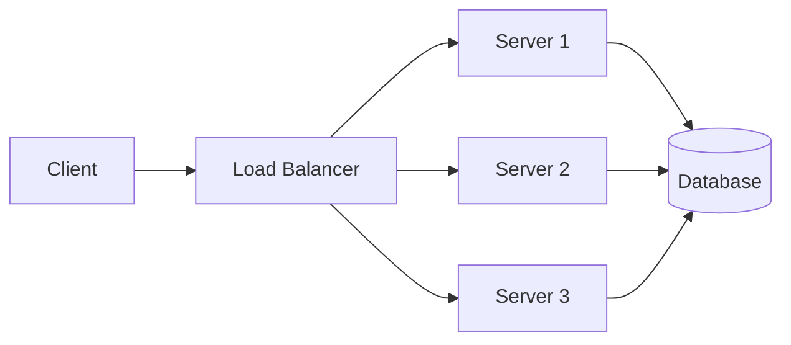

> **📅 업로드 날짜**  
> 2025-09-01
> 
> **🗂 분류**  
> network
>
> **🔗 노션 링크**  
> [노션에서 보기](https://important-marquess-d42.notion.site/Load-Balancing-25ea654e658a80dd889bd3c43c73e12f?source=copy_link)
>
# 로드 밸런싱(Load Balancing)

: 네트워크 또는 서버에 가해지는 부하(Load)를 여러 서버로 분산하여 **가용성**과 **응답 속도**를 최적화하는 기술.


- **필요성:**
    - 서비스 트래픽 증가 시 서버 과부하를 방지
    - 장애 시에도 서비스 연속성 유지
    - **Scale-out** 환경에서 필수적으로 적용됨
- **확장 방식**
    
    
    | 구분 | 설명 | 장점 | 단점 |
    | --- | --- | --- | --- |
    | **Scale-up** | 서버 자체 성능을 업그레이드 | 단일 서버 성능 극대화 | 한계 & 비용 ↑ |
    | **Scale-out** | 서버 대수를 수평 확장 | 안정성 ↑ / 확장성 ↑ | 관리 복잡 ↑ |

## 로드 밸런서(Load Balancer)

: 트래픽을 서버로 분배하는 장치 또는 서비스


- **위치:**
    
    클라이언트와 서버 사이에서 요청을 분산 처리
    
- **종류:**

| 구분 | 계층 | 특징 | 대표 예시 |
| --- | --- | --- | --- |
| **L4** | 전송 계층 (Transport Layer) | **IP 주소**와 **포트 번호**를 기준으로 트래픽 분산 | AWS NLB, HAProxy |
| **L7** | 애플리케이션 계층 (Application Layer) | **URL, 헤더, 쿠키 등 요청 내용**을 분석해 트래픽 분산 | AWS ALB, Nginx |

실제 서비스에서는 **L4 + L7 혼합 사용**하는 경우가 많음

- L4로 1차 대규모 트래픽 분산
- L7로 요청별 세부 라우팅 처리
- L4
    
    ```mermaid
    flowchart LR
        C[Client] --> LB[L4 Load Balancer]
        LB --> S1[Server 1]
        LB --> S2[Server 2]
        LB --> S3[Server 3]
    
    ```
    
    - 클라이언트 요청이 들어오면 IP·포트 기준으로 단순히 서버를 선택해 전달
    - 요청의 내용은 보지 않음
- L7
    
    ```mermaid
    flowchart LR
        C[Client] --> LB[L7 Load Balancer]
        LB -->|/api/*| API[API Server]
        LB -->|/images/*| IMG[Image Server]
        LB -->|/videos/*| VOD[Video Server]
    
    ```
    
    - 클라이언트 요청을 **URL, 헤더, 쿠키**를 분석해서 서버별로 분류해 전달
    - 요청 내용에 따라 맞춤형 분산 가능

### 기능



- **LB 역할**: 트래픽을 S1, S2, S3으로 분산
- **DB 연결**: 여러 서버에서 공통 DB 사용
- **Health Check** 기반으로 비정상 서버 자동 제외

**1. Health Check (상태 확인)**

> “서버가 살아 있는지 주기적으로 심장박동을 체크하는 기능”
> 

**설명**

- 로드 밸런서는 일정 간격으로 서버가 정상적으로 동작하는지 확인
- 만약 특정 서버가 다운되거나 응답 속도가 너무 느리다면 **트래픽 분산 대상에서 제외**합니다.
- 이 과정을 통해 서비스 장애를 최소화할 수 있음.

**예시**

1. 사용자가 `https://myshop.com`에 접속
2. 로드 밸런서는 서버 3대 중 1대(Server B)가 다운된 걸 감지
3. Server B를 제외하고 Server A, Server C로만 요청을 분산

**2. NAT (Network Address Translation)** 

> “사설망에서 쓰는 내부 IP ↔ 외부에서 보이는 공인 IP를 변환하는 기능”
> 

**설명**

- 내부 서버는 일반적으로 **사설 IP**를 사용
    
    (예: `192.168.0.10`)
    
- 하지만 인터넷 사용자들은 **공인 IP**로만 접속 가능
- 로드 밸런서는 클라이언트와 서버 사이에서 IP 주소를 변환해, 내부 서버가 공인 IP를 노출하지 않고도 안전하게 통신하도록 도와줍니다.

**종류**

| 방식 | 설명 | 예시 |
| --- | --- | --- |
| **SNAT** (Source NAT) | 내부 → 외부로 나갈 때 사설 IP → 공인 IP로 변환 | 내부 서버가 API를 호출할 때 |
| **DNAT** (Destination NAT) | 외부 → 내부로 들어올 때 공인 IP → 사설 IP로 변환 | 사용자가 쇼핑몰 접속 시, 실제 서버 IP로 연결 |

**예시**

- 고객: `203.0.113.10` (공인 IP)
- 서버: `192.168.1.10` (사설 IP)
- 로드 밸런서가 공인 IP ↔ 사설 IP 변환을 해줌으로써 외부에서는 서버 구조를 알 수 없음 → **보안성 강화**

---

**3. Tunneling (터널링)** 

> “데이터를 캡슐 속에 넣어서 안전하게 전달하는 기능”
> 

**설명**

- 로드 밸런서는 데이터 패킷을 캡슐화(encapsulation)해서 목적지까지 안전하게 보내는 기능을 지원.
- 주로 VPN(Virtual Private Network)에서 많이 사용.
- 인터넷이라는 공용 도로를 달리지만, **터널** 안을 지나듯 외부에서 데이터를 볼 수 없도록 보호합니다.

**예시 시나리오**

1. 사용자가 회사 내부 시스템에 원격 접속하려고 함
2. 로드 밸런서가 데이터를 암호화하고 캡슐화해 안전하게 전송
3. 목적지 서버에서만 캡슐을 해제해서 데이터 사용 가능

---

**4. DSR (Direct Server Return)**

> “서버에서 클라이언트로 응답을 바로 보내 성능을 높이는 기능”
> 

**설명**

- 일반적으로 요청과 응답은 둘 다 로드 밸런서를 거친다.
- 하지만 **DSR 기능**을 사용하면,
    - 요청(Request)은 로드 밸런서 → 서버
    - 응답(Response)은 서버 → 클라이언트 **직접 전송**
        
        이렇게 동작해서 **로드 밸런서의 부하를 줄이고 속도를 높입니다.**
        

**예시 시나리오**

1. 사용자가 대용량 동영상 스트리밍 요청
2. 로드 밸런서는 요청만 서버로 전달
3. 서버는 동영상 데이터를 로드 밸런서 안 거치고 클라이언트로 직접 전송
    
    → 트래픽 병목 방지, 속도 향상
    

### **알고리즘 (분산 방식)**

| 알고리즘 | 방식 | 특징 | 적합한 상황 |
| --- | --- | --- | --- |
| **라운드 로빈** | 순서대로 요청 분배 | 단순·균등 | 서버 스펙 동일 & 세션 짧은 경우 |
| **가중 라운드 로빈** | 서버별 가중치 설정 | 성능 좋은 서버 우선 | 서버 성능 차이 큰 경우 |
| **IP 해시** | IP를 해싱해 동일 서버로 매핑 | 세션 유지 용이 | 특정 사용자 고정 세션 필요 |
| **최소 연결 방식** | 연결 수가 적은 서버 우선 | 실시간 부하 기반 | 세션 길이 불규칙한 경우 |
| **최소 응답 시간** | 응답 시간 + 연결 수 고려 | 최적 성능 서버 선택 | 서버별 성능 편차 클 때 |
- **라운드 로빈**
    
    > 순서대로 차례차례 분배하는 방식
    > 
    - 첫 번째 요청 → 서버 A
    - 두 번째 요청 → 서버 B
    - 세 번째 요청 → 서버 C
    - 네 번째 요청 → 다시 서버 A
    - **모든 서버의 성능이 비슷하고 세션이 짧을 때 적합**
    
    **비유**
    
    > 3개의 카페 창구가 있으면 손님이 순서대로 창구 A → B → C로 이동하는 방식.
    > 
- **가중 라운드 로빈**
    
    > 성능 좋은 서버에 더 많은 요청을 보내는 방식
    > 
    - 서버별로 가중치(점수)를 설정
    - 성능이 좋은 서버일수록 더 많은 요청을 할당
    - 서버 A(가중치 5) → 5명, 서버 B(가중치 3) → 3명, 서버 C(가중치 2) → 2명
    
    **비유**
    
    > 알바생 3명이 있는데,
    > 
    > 
    > A는 일 잘해서 주문 5개, B는 3개, C는 2개씩 맡기는 것과 같아요.
    > 
- **최소 연결방식**
    
    > 현재 가장 한가한 서버에 먼저 보내는 방식
    > 
    - 요청이 들어올 때마다 **현재 연결 개수**를 확인하고 가장 여유 있는 서버에 우선 배정
    - 세션 시간이 길거나 트래픽 편차가 큰 서비스에서 유리
    
    **비유**
    
    > 식당에 손님이 들어올 때,
    > 
    > 
    > 손님이 가장 적은 웨이터에게 새 손님을 배정하는 것과 같아요.
    > 
- **IP 해시 방식**
    
    > 같은 사용자는 항상 같은 서버로 보내는 방식
    > 
    - 사용자의 IP 주소를 계산해서 특정 서버에 **고정 배정**
    - 사용자별 세션 유지가 필요할 때 유용
    
    **비유**
    
    > 같은 단골 손님은 항상 같은 창구 직원에게 가도록 미리 정해놓는 것과 같아요.
    > 
- **최소 응답 시간 방식**
    
    > 응답이 가장 빠른 서버에 우선 배정하는 방식
    > 
    - 서버의 **현재 부하 상태** + **응답 속도**를 모두 고려
    - 실시간 성능 측정 기반으로 최적의 서버 선택
    
    **비유**
    
    > 커피 주문을 맡길 때,
    > 
    > 
    > "현재 대기 손님도 적고 음료도 빨리 만드는 직원"에게 우선 주문을 맡기는 것과 같아요.
    > 

### **실제 서비스 사례**

- **AWS ALB(Application Load Balancer)**
    - L7 기반, HTTP/HTTPS 트래픽 분산
    - Path, Host 기반 라우팅 지원
- **AWS NLB(Network Load Balancer)**
    - L4 기반, TCP/UDP 트래픽 처리에 강점
    - 초당 수백만 요청 처리 가능
- **Nginx / HAProxy**
    - 오픈소스 기반 L4/L7 로드 밸런서
